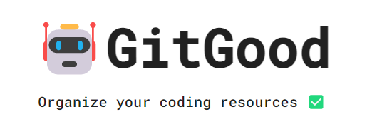

<!-- GitGood -->

# GitGood

An open source study tool to create topic categories and save useful resources as flashcards.

## Want to Contribute?

1. Clone the repo and make a new branch
1. Add a feature, fix a bug, or refactor some code :)
1. Make sure to lint your code!
1. Write/update tests for the changes you made, if necessary.
1. Run unit & integration tests and make sure all tests pass: npm test.
1. Open a Pull Request with a comprehensive description of changes to the dev branch

## Technologies

- React
- Node
- Express
- bCrypt
- JSON Web Tokens
- PostgreSQL
- MaterialUI
- Jest
- React Testing Library
- Webpack

## Screenshots
